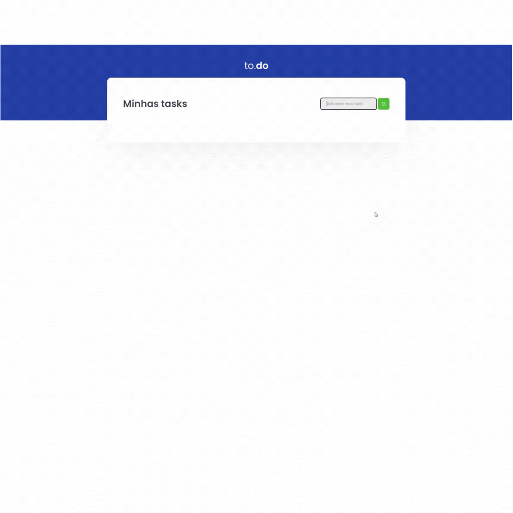

<div align="center" id="top"> 
  

&#xa0;

</div>

<h1 align="center">To-Do-List</h1>
<h2 align="center">Desafio 01 - trilha ReactJS</h2>

<p align="center">
  

  

  

  

</p>

<p align="center">
  <a href="#dart-sobre">Sobre</a> &#xa0; | &#xa0; 
  <a href="#sparkles-funcionalidades">Funcionalidades</a> &#xa0; | &#xa0;
  <a href="#rocket-tecnologias">Tecnologias</a> &#xa0; | &#xa0;
  <a href="#checkered_flag-começando">Começando</a> &#xa0; | &#xa0;
  <a href="#film_strip-demonstração">Demo</a> &#xa0; | &#xa0;
  <a href="#memo-licença">Licença</a> &#xa0; | &#xa0;
  <a href="https://github.com/cleber-santos" target="_blank">Autor</a>
</p>

<br>

## :dart: Sobre

Primeiro desafio, trilha ReactJS.
Onde foi feito um desafio a partir de um template, fornecido pela rocketseat.
O seu principal objetivo é uma pequena aplicação de atividades a fazer, para treinar um pouco mais sobre manipulação do estado no React.

- Adicionar uma nova tarefa
- Remover uma tarefa
- Marcar e desmarcar uma tarefa como concluída

Logo depois de ter feito esses topicos, foi feito os testes de funcionalidades.

## :sparkles: Funcionalidades

:heavy_check_mark: handleCreateNewTask: Deve ser possível adicionar uma nova task no estado de tasks, com os campos id que deve ser gerado de forma aleatória, title que deve ser um texto e isComplete que deve iniciar como false.;\
:heavy_check_mark: handleToggleTaskCompletion: Deve alterar o status de isComplete para uma task com um ID específico que é recebido por parâmetro. ;\
:heavy_check_mark: handleRemoveTask: Deve receber um ID por parâmetro e remover a task que contém esse ID do estado.;

## :rocket: Tecnologias

As seguintes ferramentas foram usadas na construção do projeto:

- [React](https://pt-br.reactjs.org/)
- [Webpack](https://webpack.js.org/)
- [Sass](https://sass-lang.com/)
- [Babel](https://babeljs.io/)
- [TypeScript](https://www.typescriptlang.org/)
- [Jest](https://jestjs.io/pt-BR/)

## :white_check_mark: Pré requisitos

Antes de começar :checkered_flag:, você precisa ter o [Git](https://git-scm.com) e o [Node](https://nodejs.org/en/) instalados em sua maquina.

## :checkered_flag: Começando

```bash
# Clone este repositório
$ git clone https://github.com/cleber-santos/To-do-list

# Entre na pasta
$ cd To-do-list

# Instale as dependências
$ yarn

# Para iniciar o projeto
$ yarn dev

# O app vai inicializar em <http://localhost:8080>
```

# :film_strip: Demonstração



## :memo: Licença

Este projeto está sob licença MIT. Veja o arquivo [LICENSE](LICENSE.md) para mais detalhes.

Feito com :heart: por <a href="https://github.com/cleber-santos" target="_blank">Cleber Santos</a>

&#xa0;

<a href="#top">Voltar para o topo</a>
